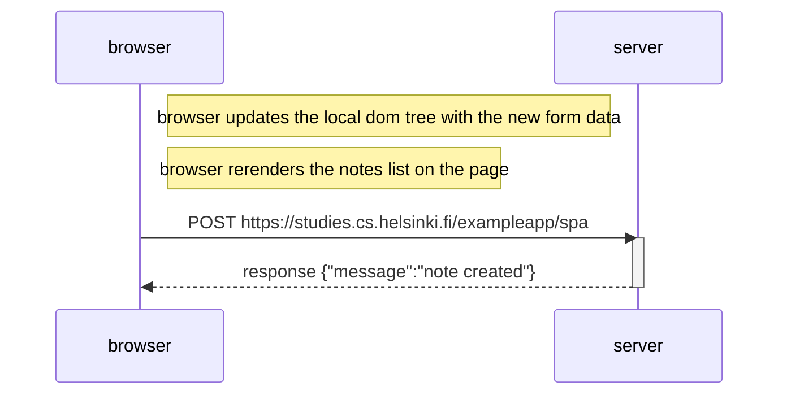

```mermaid
sequenceDiagram
    participant browser
    participant server

    note right of browser: browser updates the local dom tree with the new form data
    note right of browser: browser rerenders the notes list on the page
    
    browser->>server: POST https://studies.cs.helsinki.fi/exampleapp/spa
    activate server
    server-->>browser: response {"message":"note created"}
    deactivate server
```    